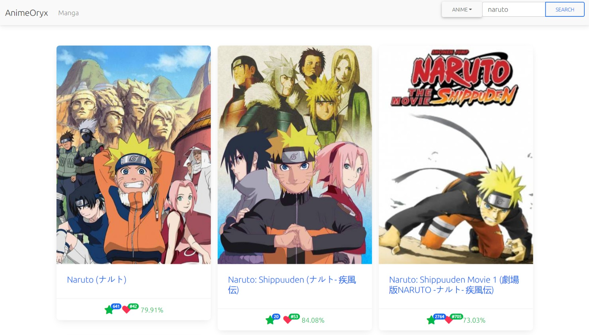

<h1> Anime Oryx</h1>

 Web Application that lets you search Anime or Manga.

<h3> Available Scripts</h3>

In the project directory, you can run:

<h3> <code>npm start</code> </h3>

Runs the app in the development mode.\
Open <a href="http://localhost:3000">http://localhost:3000</a> to view it in the browser.

<h3> <code>npm test</code></h3>

Launches the test runner in the interactive watch mode.\
See the section about <a href="https://facebook.github.io/create-react-app/docs/running-tests">running tests</a> for more information.

<h3> <code>npm run build </code> </h3>

Builds the app for production to the `build` folder.
It correctly bundles React in production mode and optimizes the build for the best performance.

<h3><code>npm run eject</code></h3>

**Note: this is a one-way operation. Once you `eject`, you can’t go back!**

If you aren’t satisfied with the build tool and configuration choices, you can `eject` at any time. This command will remove the single build dependency from your project.

<h3>Screenshot</h3>

